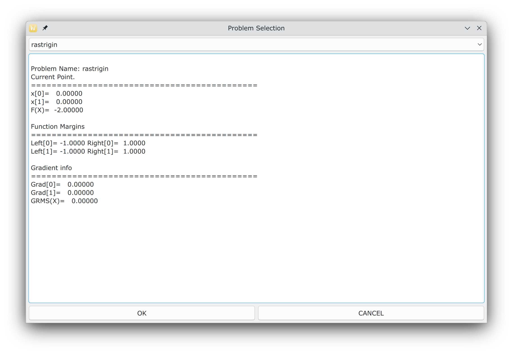
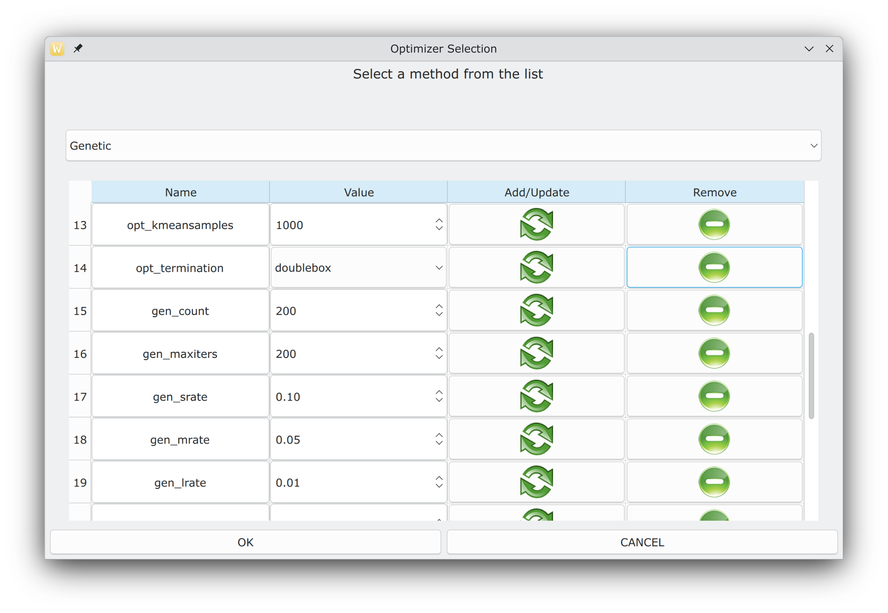
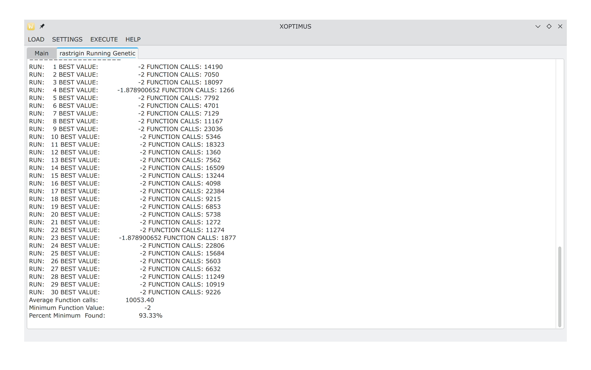

# The Optimus optimization package
This projects proposes a programming tool written in ANSI C+ for global optimization problems. The main components of the software are: a) Coding of the objective problem in a high level language such as ANSI C++ b) Incorporation of many global optimization techniques to tackle the objective problem c)Parameterization of global optimization methods using user-defined parameters.
The  documentation of each class in the package can be found in [the manual](
https://raw.githack.com/itsoulos/GlobalOptimus/master/MANUAL/docs/html/index.html) The manual files are located in the MANUAL subdirectory and the manual can be updated using the command 
```
doxygen doxyfile
```
#  Requirements
1. A C++ compiler (GNU GCC is recommended).
2. The GNU make utility
3. The OpenMP programming library
4. The QT programming library (tested with version 5.15 and 6.8)

## Linux/Openbsd installation
The steps to install the software in most Unix systems are
1. Download or clone the repository
3. Issue the command: `cd GlobalOptimus`
4. Issue the command: `qmake GlobalOptimus.pro` (or qmake-qt5 in some systems)
5. Issue the command: `make`

## Windows installation
On Windows a simple solution for the installation could be the following steps:
1. Install the software installer Choco 
2. Issue the command: choco install make
3. Issue the command: choco install mingw
4. Install the Qt library
4. Unzip the software
5. Issue the command cd GlobalOptimus-master
6. Issue the command qmake
7. Issue the command make

Alternatively, in Windows the user can use the added Setup msi executable, that can be downloaded from [here](https://www.dit.uoi.gr/files/GlobalOptimus.msi) and issue the following:

1. Install the package 
2. Εdit the 'settings' shortcut on the desktop and adjust the optimizer according to the comments
3. Open the command prompt (cmd) or PowerShell and to optimize, you can write the objective function you desire. For example, you can type 'runfunmin camel' or 'runfunmin potential 10' and so on.


<p style="text-align: justify;">
The steps of the installation are shown in Figure 1. The user needs to select only the desired installation directory and the installer copies the necessary files to this directory.
</p>

(a) First screen of the windows installation wizard.


(b) The user selects the desired installation directory


(c) Prompt to install.


(d) Copying files.


(e) Finalizing installation.


**Figure 1.** The steps of windows installation


##  The GUI application 
<p style="text-align: justify;">
The software also provides a graphical interface with which the user can easily select an objective function, optimization method and modify them by changing a number of available parameters. The software is called Xoptimus and the user can compile this program using the commands: 
</p>

1. qmake Xoptimus.pro 
2. make 

Also, in Windows environments the Xoptimus.msi that can be downloaded from   [here](https://www.dit.uoi.gr/files/Xoptimus.msi)  package will install this program. After invoking the program the first screen that is appeared is shown in Figure 6.


**Figure 6.** The start screen of Xoptimus program.
<p style="text-align: justify;">
The user should select first the LOAD menu in order to define the objective problem and the desired global optimization method that should be used. The screen of Figure 7 is shown when the user select the option PROBLEM from the LOAD menu.
</p>




**Figure 7.** Selecting an optimization problem.
<p style="text-align: justify;">
The user can select from a variety of offered objective functions from the dropdown menu. For each selected function the bounds are shown in the screen. Having selected the objective problem, the user should also selects the desired global optimization method from the option METHOD of the LOAD menu. This choice shows the dialog of Figure 8 in the screen. 
</p>




**Figure 8.** Selecting an optimization method.
<p style="text-align: justify;">
From this dialog, the user can select the global optimization method from a dropdown menu and the user can also modify some of the parameters of the method, such as the number of chromosomes in the Genetic algorithm. Having selected the function and the desired global optimization method, the user can start the optimization process by invoking the option RUN from the menu EXECUTE. The selected global optimization method initiates and an example of the execution is shown in Figure 9.
</p>




**Figure 9.** Executing the selected optimization method.

## Available Global Optimization methods
The implemented Global Optimization methods are:
1. The Differential Evolution denoted as **DifferentialEvolution**.
2. The Parallel Differential Evolution method (utilizing the OpenMP library), denoted as **ParallelDe**.
3. A genetic algorithm, denoted as **Genetic** in the package.
4. An improved version of the Particle Swarm Optimizer, denoted as **iPSO**.
5. A simple **Multistart** method, which initiates many local optimization procedures to discover the global optimum of a function.
6. The **NeuralMinimizer** method, which constructs an estimated function of the objective problem using Neural Networks. 
7. A parallel Particle Swarm Optimizer (using the OpenMP library), denoted as **ParallelPso**.
8. A Simulated Annealing optimizer, denoted as **Simman**.
9. The optimal foraging algorithm (OFA), donated as **Ofa**.
10. Bio-inspired metaheuristic algorithm Giant Armadillo Optimization (GAO), denoted as **armadillo1**.
11. The Gray Wolf Optimizer (GWO), donated as **Gwo**.

## Available Local Optimization methods
All global optimization methods can be enhanced by applying a local minimization method after they are terminated. The parameter used to determine the used local optimization procedure is the --opt_localsearch parameter. The implemented local optimization methods are the following:
1. The **bfgs** method. The Broyden–Fletcher–Goldfarb–Shanno (BFGS) algorithm was implemented using a variant of Powell.
2. The limited memory BFGS method (**lbfgs**).
3. The Gradient descent method. This method is denoted as **gradient**.
4. The Nelder Mead method (denoted as **nelderMead**).
5. The Adam optimizer (denoted as **adam**).

## Problem example
Consider the Rastrigin problem, defined as: 
 $f(x)=x_{1}^{2}+x_{2}^{2}-\cos(18x_1)-\cos(18x_2)$. This function is implemented as rastriginproblem.cpp in the PROBLEMS subdirectory of the distribution.  The RastriginProblem class contains the following main methods:
 1. The constructor method `RastriginProblem`. In this function dimension of the objective function should be 
 defined as well as the bounds of this function.  For the case of this function the bounds are defined in $[-1,1]^2$. The code for this method has as follows
 ```c++
 RastriginProblem::RastriginProblem()
    : Problem(2)
{
    Data l, r;
    l.resize(2);
    r.resize(2);
    for (int i = 0; i < 2; i++)
    {
        l[i] = -1.0;
        r[i] = 1.0;
    }
    setLeftMargin(l);
    setRightMargin(r);
}
 ```
 The method `setLeftMargin()` is used to change the left bound of the objective function and the method `setRightMargin()` is used for the corresponding right bound of the objective function. The dimension of the objective function is set to 2 and this is defined using the call to the Problem constructor with the line Problem(2).
 2. The method `funmin`. This method defines the objective function that should be minimized by any optimization method. For the case of the Rastrigin Problem the following definition is used:
 ```c++
 double RastriginProblem::funmin(Data &x)
{
    return x[0] * x[0] + x[1] * x[1] - cos(18.0 * x[0]) - cos(18.0 * x[1]);
}
 ```
 The vector x defined the point where the objective function should be evaluated.
 3. The method `gradient`. This method stands for the gradient of the objective function, evaluated at a specific point. If the gradient vector can be calculated analytically, then the user should enter the code in this function. Otherwise, he can use some numerical calculation method such as finite differences. The code for the gradient of the Rastrigin problem has as follows:
 ```c++
Data RastriginProblem::gradient(Data &x)
{
    Data g;
    g.resize(2);
    g[0] = 2.0 * x[0] + 18.0 * sin(18.0 * x[0]);
    g[1] = 2.0 * x[1] + 18.0 * sin(18.0 * x[1]);
    return g;
}
 ```
The vector g created at this method contains the gradient estimated at point x. The user can optimize the Rastrigin function using the main executable GlobalOptimus. An example of execution could be the following:
```
./GlobalOptimus --opt_problem=rastrigin --opt_method=Genetic --opt_localsearch=lbfgs --opt_iters=1  --opt_debug=yes
```
This command will optimize the rastrigin test function using the Genetic Algorithm optimizer. The parameters used here have the following meaning:

1. The parameter --opt_localsearch  defines the used local optimization procedure, that should invoked after the termination of the Genetic Algorithm. In  this case the Lbfgs optimization method will be used.
2. The parameter --opt_iters stands for the number of  executions of the Genetic Algorithm. In thise case the number of executions are 1.
3. The parameter --opt_debug indicates if the genetic algorithm will print debug messages in the standard output.

 
For convenience, all objective problems have been stored in the PROBLEMS folder of the existing distribution, although the programmer can easily create his own objective function simply by overriding the class Problem. The user can also implement the methods of class UserProblem found in the PROBLEMS subdirectory in order to create a new test function. The contents of the file userproblem.cpp are shown below
```c++
#include "userproblem.h" 
# include <stdio.h> 
UserProblem::UserProblem() :Problem(1) 
{
}
double  UserProblem::funmin(Data &x) 
{     
	printf("This is a simple test function.\n");     
	return 0.0; 
}
Data UserProblem::gradient(Data &x) 
{     
	Data g;     
	g.resize(x.size());     
	return g; 
}
void    UserProblem::init(QJsonObject &params) 
{
}
QJsonObject UserProblem::done(Data &x)
{
}
UserProblem::~UserProblem() {
}
```
The class has two additional methods that may be used by the user:
1. `void init(QJsonObject &params)`. The function `init()` is called before the objective function is executed and its purpose is to pass parameters from the execution environment to the objective function. These parameters are passed from the main executed program and as an example consider the following json object:
```
 {
    "problem_atoms":3,
    "problem_debug":"yes"
 }
```
This information could be the number of atoms for a molecular potential and a flag to enable or disable debug messages. This information can be obtained in the `init()` function with the following sample of c++ code:
```c++
natoms = params["problem_atoms"].toString().toInt();
debug  = params["problem_debug"].toString();
```
These parameters are passed on the command line to the `Optimus` program by using keys that do not belong to the main program or any of the global optimization methods available in this software package.
If the parameters are not passed to the function, sensible default values should be provided. 


2. `QJsonObject done(Data &x)`. This function is executed after the objective function optimization process is completed. The vector x represents the last located value from the used global optimizer, i.e. the estimated global minimum. The function done() may use this information for any purpose, such as to store this value to a file or use the vector x as the weights of a neural network and to estimate subsequently the test error for this neural network. The function returns a Json object that may contain valuable information about the termnination of the whole process, such as the estimated test error of the neural network exampled mentioned before. An example of this process could be the following:
```c++
QJsonObject info;
info["test_error"]=value;
return info;
```

Having completed the coding of userproblem.cpp, the user must re - compile the software. This is also needed if the user has installed the software using the accompanyied `.msi` file from the distribution, after which the newly compiled binary needs to be used instead of the previously installed one. 
After the re - compilation  a simple execution of the user problem could be the following one:
```
./GlobalOptimus --opt_problem=userproblem --opt_method=Genetic --opt_iters=1  --opt_debug=yes
```

This line optimizes the userproblem with the Genetic Algorithm optimizer.


## Testing
> See also [Automatic Testing](#automatic-testing)

The main executable GlobalOptimus has a series of command line options that will be used to optimize the objective functions located under PROBLEMS subdirectory.
Also, the program can be used for testing puproses in order to validate the efficiency of the implemeted global optimization methods as well as 
it can also be used to verify the correctness of writing any test function.  The command line options of the GlobalOptimus are divided into 3 categories:
1. Global options. These parameters configure the overall behavior of the software and begin with the prefix opt in their name. Among these, one can identify the following:
    - `--opt_problem`: This option is used to define the objective function to be used.
    - `--opt_method`: This option determines the global optimization method to be used during optimization. 
    - `--opt_iters`: This parameter defines the number of different executions for the global optimization method chosen by the user. With this option, the  stability of the selected  global optimization can be measured in the location of the global minimum.
    - `--opt_debug`: This option has two values: yes and no. If the used pass the value yes, then the program will print debug messages for every used global optimization method.
    - `--opt_localsearch`: This option is used to select the local optimization method that will be used by the global optimizer.
    - `--opt_sampler`: This option sets the sampling technique used in a series of global optimization methods, such as genetic algorithm, pso, multistart etc. The available values are: **uniform**, **maxwell**, **triangular**, **mlp**, **rbf**, **kmeans**.


2. Optimizer options. All global optimization techniques included in this software use a series of parameters to improve their performance. For example, the user can set the number of chromosomes to 200 in the genetic algorithm with the parameter --gen_count=200. The list with all parameters used by the global optimization methods can be printed using the following command:
```
./GlobalOptimus --help
```

3. Problem options. The remaining command line options are considered as options that should be passed to the optimization problem.

As a full working example, that may be used to test the effectiveness of the Genetic Algorithm to estimate the global minimum of the function $f(x)= \frac{1}{2}\sum_{i=1}^{n}(x_{i}^4-16x_i^{2}+5x_i)$. This function has $2^{n}$ local minima in the range $[-5,5]^{n}$ and it is represented by the name test2n in the optimization package.  During the first test, the test2n function where $n=4$ is minimized with the following command:
```
./GlobalOptimus  --opt_problem=test2n --opt_method=Genetic --opt_debug=no --opt_iters=10 --opt_dimension=4
```
The last parameter opt_dimension is passed to the optimization function. The output from this command will be:
```
Executions:   10
===================
RUN:    1 BEST VALUE:         -156.6646628 FUNCTION CALLS: 1442
RUN:    2 BEST VALUE:         -156.6646628 FUNCTION CALLS: 5284
RUN:    3 BEST VALUE:         -156.6646628 FUNCTION CALLS: 1610
RUN:    4 BEST VALUE:         -156.6646628 FUNCTION CALLS: 3795
RUN:    5 BEST VALUE:         -156.6646628 FUNCTION CALLS: 1390
RUN:    6 BEST VALUE:         -156.6646628 FUNCTION CALLS: 46462
RUN:    7 BEST VALUE:         -156.6646628 FUNCTION CALLS: 2066
RUN:    8 BEST VALUE:         -142.5279438 FUNCTION CALLS: 1343
RUN:    9 BEST VALUE:         -156.6646628 FUNCTION CALLS: 22712
RUN:   10 BEST VALUE:         -156.6646628 FUNCTION CALLS: 19590
Average Function calls:             10569.40
Minimum Function Value:         -156.6646628
Percent Minimum  Found:                90.00%
```
The program prints in standard output the global minimum located in every run and the required number of function calls. At the end, the average number of function calls and the percentage of the runs where the same global minimum was found are printed.
If the dimension of the objective function is increased to $n=5$, then the following command is used for the corresponding optimization:
```
./GlobalOptimus  --opt_problem=test2n --opt_method=Genetic --opt_debug=no --opt_iters=10 --opt_dimension=5
```
The output for this command (in Debian Linux ) could be the following:
```
Executions:   10
===================
RUN:    1 BEST VALUE:         -181.6941095 FUNCTION CALLS: 1971
RUN:    2 BEST VALUE:         -181.6941095 FUNCTION CALLS: 2038
RUN:    3 BEST VALUE:         -195.8308285 FUNCTION CALLS: 1238
RUN:    4 BEST VALUE:         -195.8308285 FUNCTION CALLS: 41601
RUN:    5 BEST VALUE:         -195.8308285 FUNCTION CALLS: 1387
RUN:    6 BEST VALUE:         -181.6941095 FUNCTION CALLS: 1360
RUN:    7 BEST VALUE:         -181.6941095 FUNCTION CALLS: 4092
RUN:    8 BEST VALUE:         -195.8308285 FUNCTION CALLS: 35729
RUN:    9 BEST VALUE:         -195.8308285 FUNCTION CALLS: 2760
RUN:   10 BEST VALUE:         -195.8308285 FUNCTION CALLS: 19691
Average Function calls:             11186.70
Minimum Function Value:         -195.8308285
Percent Minimum  Found:                60.00%
```
As it was expected, the required number of function calls increased but the success rate of the genetic algorithm dropped from 90% to 60%, because of the increase in the dimension of the objective function. The following command
```
./GlobalOptimus  --opt_problem=test2n --opt_method=Genetic --opt_debug=no --opt_iters=10 --opt_dimension=5 --gen_lrate=0.05
```
utilizes again the Genetic Algorithm for the test2n function with $n=5$, but the local search rate is set to 0.05 (5%). This parameter determines the number of chromosomes to which a local minimization method will be applied in each generation. The output from the previous command is:
```
Executions:   10
===================
RUN:    1 BEST VALUE:         -195.8308285 FUNCTION CALLS: 8700
RUN:    2 BEST VALUE:         -181.6941095 FUNCTION CALLS: 3159
RUN:    3 BEST VALUE:         -195.8308285 FUNCTION CALLS: 3060
RUN:    4 BEST VALUE:         -195.8308285 FUNCTION CALLS: 3806
RUN:    5 BEST VALUE:         -195.8308285 FUNCTION CALLS: 2860
RUN:    6 BEST VALUE:         -195.8308285 FUNCTION CALLS: 8504
RUN:    7 BEST VALUE:         -195.8308285 FUNCTION CALLS: 3597
RUN:    8 BEST VALUE:         -195.8308285 FUNCTION CALLS: 16090
RUN:    9 BEST VALUE:         -195.8308285 FUNCTION CALLS: 3736
RUN:   10 BEST VALUE:         -195.8308285 FUNCTION CALLS: 9152
Average Function calls:              6266.40
Minimum Function Value:         -195.8308285
Percent Minimum  Found:                90.00%
```
As we can see, the incorporation of the local search method increased the success rate of the genetic algorithm from 60% to 90%. 

## Comparing with known global optima
The user can set the known global minimum using the following method in Problem class:
```c++    
void setKnownOptimum(double value, const Data& location);
```
This method defines the expected global minimum that will be discovered by any applied global optimization method. In several of the available software examples, the expected global minimum has been defined. These expected minima are available from the relevant literature. If the user has defined the expected minimum, then the main program will display at the end the percentage of runs in which this minimum was found by the global optimization method used. As an example of output consider the following line obtained by the application of the Genetic Algorithm to the Griewank10 test problem
``
Percentage of known global minimum found: 93.33%
``

Furthermore, the option "--opt_enabletesting" can be used to require the software to perform a series of global optimization 
methods on the selected problem. For example the following command
``
./GlobalOptimus  --opt_problem=bf1 --opt_enabletesting=yes
``
will apply a series of global optimization methods on the test problem bf1 and the final line of the printing will be
``
Percentage of global minimum found:  79.5238 %
`` 
which indicates the number of all executions where the global minima was discovered successfully. The global optimization methods used in this test are:
1. The Multistart method.
2. A simple Genetic algorithm.
3. The Giant Armadillo method.
4. The Particle Swarm Optimization method.
5. The Nelder Mead method.
6. The Differential Evolution method.


The following table presents the percentage of global minimum usin the previous procesure for a series of problems with known global minimum.
| Problem    | Percentage found |
| -------- | ------- |
| Bf1  | 83.33%    |
| Bf2 |  80.95%    |
| Rastrigin    | 83.81%    |
| Griewank2    | 81.43%    |
| Griewank10    |62.86%    |

## Automatic testing
The distribution includes three distinct scripts to perform automatic tests for functions with known global optimum
1. The script single_test.sh that is used to apply a series of optimization methods to a selected problem. The user can invoke this script using the following command
```
./single_test.sh bf1
```
This line will apply a series of optimization methods to bf1 test function and will be reported the produced results.

2. The script all_test.sh is used to apply the series of optimization methods to all test problems having known global minimum. The user can invoke this script using the following command:
```
./all_test.sh
``` 
3. The script install_and_test.sh is used to compile the software using the qmake utility and test the problem provided as its first argument. The user can invoke this script as in the following example:
```
./install_and_test.sh bf2
```

## The script runfunmin.sh
`runfunmin.sh` is a script used to run the GlobalOptimus application, which is an optimization platform. The script is designed to provide flexibility, allowing the selection of various optimization methods, local searches, sampling methods, and termination criteria.
This script can be used to automate experiments on functions and to define the parameters of each global optimization method. By changing a series of simple variables contained within it, the user can facilitate the execution of the required experiments and accelerate their implementation.

**runfunmin.sh uses different parameters to:** 
1. To choose the optimization method to be used 
2. To configure the parameters of the method 
3. To specify local search, sampling, and termination mode.


**1.Declaration of Variables** 
- METHOD: Specifies which optimization method will be used 
- LOCALSEARCH: Specifies the local search method 
- SAMPLER: Selects the sampling method 
- TERMINATION: Defines the termination criterion

**2. Setting Methods**
runfunmin.sh checks which method is selected via the METHOD variable. For each method, the appropriate parameters are added to the METHODPARAMS variable. 

**3. Problem and Dimensions**
runfunmin.sh expects two additional parameters from the command line:
- PROBLEM: The name of the problem
- DIMENSION: The dimensions of the problem

**4. Run GlobalOptimus**
Finally, it runs the GlobalOptimus application with the configured parameters

runfunmin.sh is great for testing different methods on different problems.  Parameter selection gives a lot of control to the user. It supports excellent extensibility as new methods or parameters can be added.

