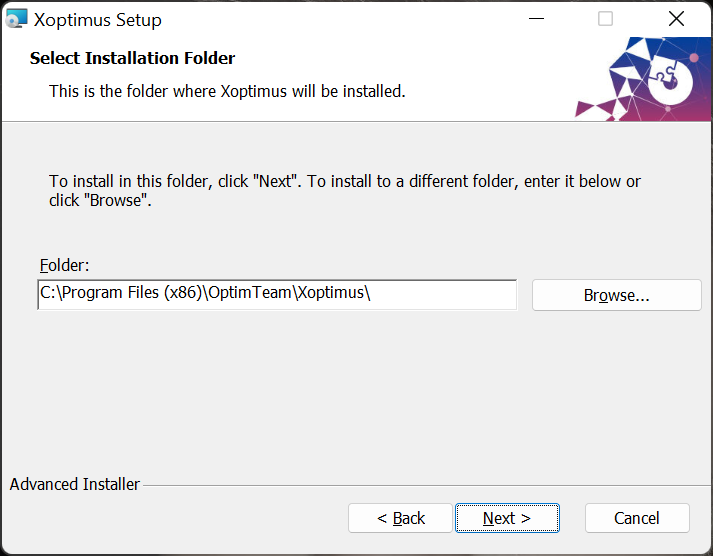
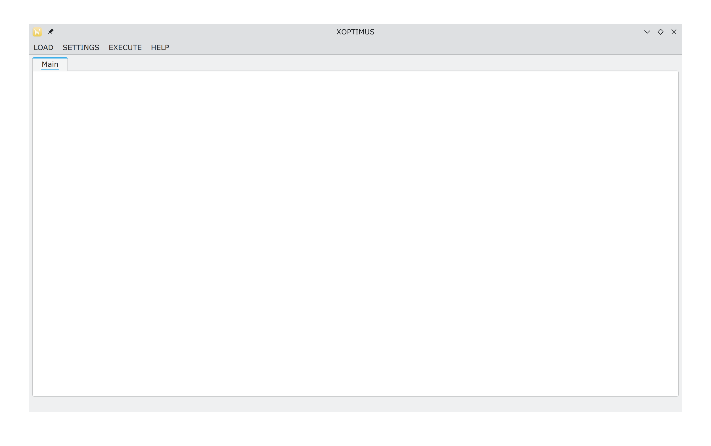

# The Optimus optimization package
This projects proposes a programming tool written in ANSI C+ for global optimization problems. The main components of the software are: a) Coding of the objective problem in a high level language such as ANSI C++ b) Incorporation of many global optimization techniques to tackle the objective problem c)Parameterization of global optimization methods using user-defined parameters.
#  Requirements
1. A C++ compiler (GNU GCC is recommended).
2. The GNU make utility
3. The OpenMP programming library
4. The QT programming library (tested with version 5.15 and 6.8)

## Linux/Openbsd installation
The steps to install the software in most Unix systems are
1. Download or clone the repository
3. Issue the command: `cd GlobalOptimus`
4. Issue the command: `qmake GlobalOptimus.pro` (or qmake-qt5 in some systems)
5. Issue the command: `make`

## Windows installation
On Windows a simple solution for the installation could be the following steps:
1. Install the software installer Choco 
2. Issue the command: choco install make
3. Issue the command: choco install mingw
4. Install the Qt library
4. Unzip the software
5. Issue the command cd GlobalOptimus-master
6. Issue the command qmake
7. Issue the command make

Alternatively, in Windows the user can use the added Setup msi executable, that can be downloaded from [here](https://www.dit.uoi.gr/files/GlobalOptimus.msi) and issue the following:

1. Install the package 
2. Εdit the 'settings' shortcut on the desktop and adjust the optimizer according to the comments
3. Open the command prompt (cmd) or PowerShell and to optimize, you can write the objective function you desire. For example, you can type 'runfunmin camel' or 'runfunmin potential 10' and so on.


<p style="text-align: justify;">
The steps of the installation are shown in Figure 1. The user needs to select only the desired installation directory and the installer copies the necessary files to this directory.
</p>

(a) First screen of the windows installation wizard.


(b) The user selects the desired installation directory



(c) Prompt to install.


(d) Copying files.


(e) Finalizing installation.


**Figure 1.** The steps of windows installation


##  The GUI application 
<p style="text-align: justify;">
The software also provides a graphical interface with which the user can easily select an objective function, optimization method and modify them by changing a number of available parameters. The software is called Xoptimus and the user can compile this program using the commands: 
</p>

1. qmake Xoptimus.pro 
2. make 

Also, in Windows environments the Xoptimus.msi that can be downloaded from   [here](https://www.dit.uoi.gr/files/Xoptimus.msi)  package will install this program. After invoking the program the first screen that is appeared is shown in Figure 6.




**Figure 6.** The start screen of Xoptimus program.
<p style="text-align: justify;">
The user should select first the LOAD menu in order to define the objective problem and the desired global optimization method that should be used. The screen of Figure 7 is shown when the user select the option PROBLEM from the LOAD menu.
</p>


**Figure 7.** Selecting an optimization problem.
<p style="text-align: justify;">
The user can select from a variety of offered objective functions from the dropdown menu. For each selected function the bounds are shown in the screen. Having selected the objective problem, the user should also selects the desired global optimization method from the option METHOD of the LOAD menu. This choice shows the dialog of Figure 8 in the screen. 
</p>


**Figure 8.** Selecting an optimization method.
<p style="text-align: justify;">
From this dialog, the user can select the global optimization method from a dropdown menu and the user can also modify some of the parameters of the method, such as the number of chromosomes in the Genetic algorithm. Having selected the function and the desired global optimization method, the user can start the optimization process by invoking the option RUN from the menu EXECUTE. The selected global optimization method initiates and an example of the execution is shown in Figure 9.
</p>


**Figure 9.** Executing the selected optimization method.

## Available Global Optimization methods
The implemented Global Optimization methods are:
1. The Differential Evolution denoted as DifferentialEvolution.
2. The Parallel Differential Evolution method (utilizing the OpenMP library), denoted as ParallelDe.
3. A genetic algorithm, denoted as Genetic in the package.
4. An improved version of the Particle Swarm Optimizer, denoted as iPSO
5. A simple Multistart method, which initiates many local optimization procedures to discover the global optimum of a function.
6. The NeuralMinimizer method, which constructs an estimated function of the objective problem using Neural Networks.
7. A parallel Particle Swarm Optimizer (using the OpenMP library), denoted as ParallelPso.
8. A Simulated Annealing optimizer, denoted as Simman.
9. The optimal foraging algorithm (OFA), donated as Ofa.
10. Bio-inspired metaheuristic algorithm Giant Armadillo Optimization (GAO), donated as armadillo1.
11. The Gray Wolf Optimizer (GWO), donated as Gwo.

## Available Local Optimization methods
All global optimization methods can be enhanced by applying a local minimization method after they are terminated. The parameter used to determine the used local optimization procedure is the --opt_localsearch parameter. The implemented local optimization methods are the following:
1. The bfgs method. The Broyden–Fletcher–Goldfarb–Shanno (BFGS) algorithm was implemented using a variant of Powell.
2. The limited memory BFGS method (lbfgs).
3. The Gradient descent method. This method is denoted as gradient.
4. The Nelder Mead method (denoted as nelderMead).
5. The Adam optimizer (denoted as adam).

## Problem example
Consider the Rastrigin problem, defined as: 
 $f(x)=x_{1}^{2}+x_{2}^{2}-\cos(18x_1)-\cos(18x_2)$. This function is implemented as rastriginproblem.cpp in the PROBLEMS subdirectory of the distribution.  The RastriginProblem class contains the following main methods:
 1. The constructor method RastriginProblem. In this function dimension of the objective function should be 
 defined as well as the bounds of this function.  For the case of this function the bounds are defined in $[-1,1]^2$. The code for this method has as follows
 ```
 RastriginProblem::RastriginProblem()
    : Problem(2)
{
    Data l, r;
    l.resize(2);
    r.resize(2);
    for (int i = 0; i < 2; i++)
    {
        l[i] = -1.0;
        r[i] = 1.0;
    }
    setLeftMargin(l);
    setRightMargin(r);
}
 ```
 The method setLeftMargin() is used to change the left bound of the objective function and the method setRightMargin() is used for the corresponding right bound of the objective function. The dimension of the objective function is set to 2 and this is defined using the call to the Problem constructor with the line Problem(2).
 2. The method funmin. This method defines the objective function that should be minimized by any optimization method. For the case of the Rastrigin Problem the following definition is used:
 ```
 double RastriginProblem::funmin(Data &x)
{
    return x[0] * x[0] + x[1] * x[1] - cos(18.0 * x[0]) - cos(18.0 * x[1]);
}
 ```
 The vector x defined the point where the objective function should be evaluated.
 3. The method gradient. This method stands for the gradient of the objective function, evaluated at a specific point. If the gradient vector can be calculated analytically, then the user should enter the code in this function. Otherwise, he can use some numerical calculation method such as finite differences. The code for the gradient of the Rastrigin problem has as follows:
 ```
Data RastriginProblem::gradient(Data &x)
{
    Data g;
    g.resize(2);
    g[0] = 2.0 * x[0] + 18.0 * sin(18.0 * x[0]);
    g[1] = 2.0 * x[1] + 18.0 * sin(18.0 * x[1]);
    return g;
}
 ```
The vector g created at this method contains the gradient estimated at point x. 
 
## Implementing a user defined function
For convenience, all objective problems have been stored in the PROBLEMS folder of the existing distribution, although the programmer can easily create his own objective function simply by overriding the class Problem. The user can also implement the methods of class UserProblem found in the PROBLEMS subdirectory in order to create a new test function. The contents of the file userproblem.cpp are shown below
```
#include "userproblem.h" 
# include <stdio.h> 
UserProblem::UserProblem() :Problem(1) 
{
}
double  UserProblem::funmin(Data &x) 
{     
	printf("This is a simple test function.\n");     
	return 0.0; 
}
Data UserProblem::gradient(Data &x) 
{     
	Data g;     
	g.resize(x.size());     
	return g; 
}
void    UserProblem::init(QJsonObject &params) 
{
}
QJsonObject UserProblem::done(Data &x)
{
}
UserProblem::~UserProblem() {
}
```
The class has two additional methods that may be used by the user:
1. void init(QJsonObject &params). The function init() is called before the objective function is executed and its purpose is to pass parameters from the execution environment to the objective function. 
2. QJsonObject done(Data &x). This function is executed after the objective function optimization process is completed. The point x is the global minimum for the function f(x). 

## The script runfunmin.sh
It is a script to simplify the optimization tasks, used in Unix environments. A similar script for Windows environments is called runfunmin.bat

## Testing
The program GlobalOptimus will print at the end of the execution the following information
1. The global minimum located in every run.
2. The average functions calls.
3. The lowest function value.
4. The percentage of the runs, where the global minimum was obtained.
5. The standard deviation of the function calls. 


