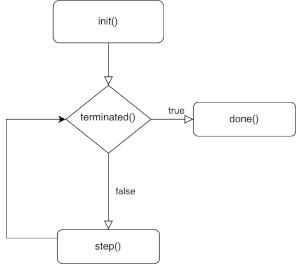
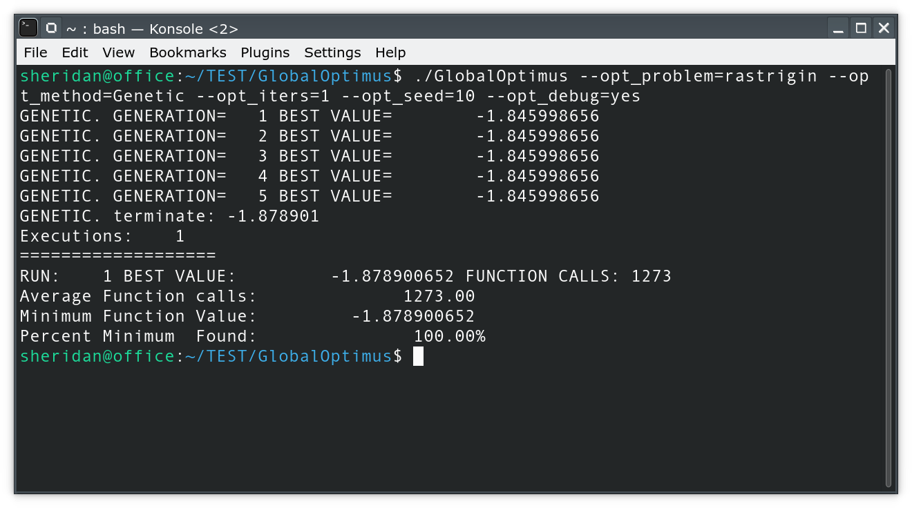

# Summary

The location of global minima is applied in a variety of problems derived from physics [@duan1992effective_1992], chemistry [@liwo1999protein_1999], medicine [@lee2007large_2007] etc. Also, global optimization can be used in complex problems, such as the training of neural networks [@chiroma2017neural_2017]. Methods used in the global optimization process can be divided into stochastic and deterministic and  a comparison between methods of these categories can be found in the work of Sergeyev et al.[@sergeyev2018efficiency_2018]. This article proposes a software that incorporates a variety of stochastic methods to handle the optimization of multidimensional functions.

# Statement of need

This paper presents the `GlobalOptimus` software,  written in ANSI C++, which allows researchers wanting to solve optimization problems in their domain to formulate their optimization problems and apply different global optimization methods to identify the global minimum of the problem. The main features of the proposed software are: a) Coding of the objective problem in a high level language such as ANSI C++ b) Incorporation of many global optimization techniques to solve the objective problem c) Parameterization of global optimization methods using user-defined parameters d) Usage of a GUI application to control the optimization strategy.
 
Some of the frequently used optimization tools are MATLAB Optimization Toolbox, SciPy optimization module and Gurobi. MATLAB and SciPy are usually based on high-level languages, which can limit performance when computational problems are required.
 
GlobalOptimus is an algorithmic optimization tool written in C++, which combines high performance with ease of parameterization for solving optimization problems in various domains. Unlike other tools, it stands out for its open architecture and adaptability, allowing full customization and integration of software from other platforms without restrictions. In addition, GlobalOptimus supports multiple optimization algorithms, such as genetic algorithms and differential evolution, giving flexibility in formulating the optimal method for each problem. Although both MATLAB and SciPy offer support for such algorithms, GlobalOptimus provides one extensible approach.
Finally, Gurobi is an extremely powerful tool for mathematical optimization, but it requires a commercial license. Instead, GlobalOptimus is open source, which makes it more accessible to researchers and developers who wish to adapt it to their needs.

# Usage of the Software 

The software is compiled using the QT library, available from  https://qt.io. The researcher should code their objective function and a number of other mandatory functions in the C++ programming language, specifying the dimension of the objective function and the bounds of the function domain. Subsequently, they can select a global optimization method to apply to the problem from a wide range of available methods.

In addition, the user can create his own objective function by implementing the methods of category `UserProblem`,
the methods of which are presented in the following diagram.
{width= 50% }

## Implemented global optimization methods

 In the proposed software, each implemented global optimization method has a set of parameters that can determine the overall optimization path and the effectiveness of the method. Some of the global optimization methods are as follows: 

 

METHOD |  DESCRIPTION |
|----------|----------|
| **Differential Evolution**   |An evolutionary algorithm used  in many areas [@pant2020differential_2020]|
| **Parallel Differential Evolution**| A parallel version of the Differential Evolution method [@charilogis2023parallel_2023].|
| **Double precision genetic algorithm**  | An Improved version of the Genetic Algorithm [@tsoulos2008modifications_2008].|
| **Improved Particle Swarm Optimization**  |Suggested as an improvement of the PSO method [@charilogis2022toward_2022].|
| **Multistart**  |Initiates local searches from different start points [@marti2010advanced_2010].|
| **NeuralMinimizer**| Utilizes Radial Basis Functions (RBF) networks to increase the speed of the Multistart method [@tsoulos2023neuralminimizer_2023].|
| **Parallel Particle Swarm optimizer**  | A novell parallel PSO variant, published recently [@charilogis2023improved_2023].|
| **Simulated annealing optimizer**  | included in the software under the name Simman [@kirkpatrick1983optimization_1983]. |
| **The optimal foraging algorithm (OFA)**  | motivated by animal behavioral ecology included the software named Ofa [@kyrou2024eofa_2024].|
| **Bio-inspired metaheuristic algorithm Giant Armadillo Optimization (GAO)** |  This process mimics the natural behavior of the giant armadillo [@kyrou2024improving_2024]. |
| **The Gray Wolf Optimizer (GWO)** |  This process mimics hunting mechanism of gray wolves in nature [@li2021improved_2021].|

##  Implemented local optimization methods

The parameter `−−opt_localsearch` is used to select the used local optimization procedure. The implemented local optimization methods are the following: 

METHOD |  DESCRIPTION |
|----------|----------|
|  **The bfgs method**        | The Broyden–Fletcher–Goldfarb–Shanno (BFGS) algorithm was implemented [@powell1989tolerant_1989].|
|  **The lbfgs method**      | The limited memory BFGS method is implemented as an approximation of the BFGS method using a limited amount of computer memory [@liu1989limited_1989]. |
|**The Gradient descent method** | This method is denoted as gradient in the software and  implements the Gradient Descent local optimization   procedure [@amari1993backpropagation_1993].|
| **The Nelder Mead method**  |The Nelder Mead simplex procedure for local optimization  is also included in the software [@olsson1975nelder_1975].   |
|  **The adam method**  |  The adam  optimizer [@kingma2014adam_2014].  |

## Implementing a user-defined optimization method

The software can be extended by implementing custom optimization techniques by extending the optimization method class `UserMethod` and implementing the provided functions according to the requirements of the method.

Method   |  DESCRIPTION |
|----------|----------|
|    **init()**     | This function is called every time the optimization method starts|                                    
|    **step()**    | This function implements the actual step of the optimization method. |                                            
|    **terminated()**    | This function is used as the termination step of the optimization method.|                                   
|    **done()**    |   This function will be called when the optimization method terminates.|                                       
|   **~UserMethod()**     |    This is the destructor of the optimization method.  |                                            

A flowchart of any used optimization process is outlined in \autoref{FIG:optimization}.

{width= 50% }

An example run for the Rastrigin function and the Genetic algorithm is outlined in \autoref{FIG:rastrigin}.

#  Conclusions

In this work, an environment for executing global optimization problems was presented, where the user can implement their optimization problem using a set of predefined functions and then has the possibility to choose among several global optimization methods to solve the defined problem. In addition, it is given the possibility to choose to use a local optimization method to enhance the reliability of the produced results. This programming environment is freely available and easy to extend to accommodate more global optimization techniques. 

# References
