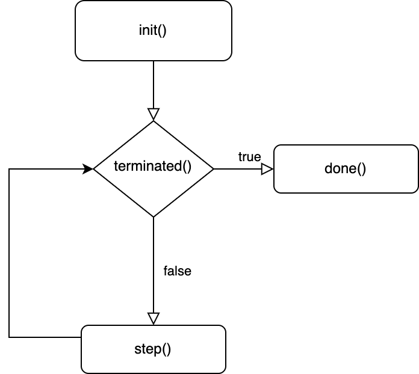
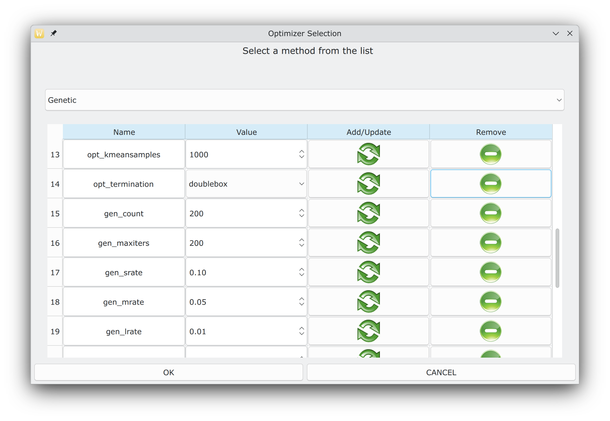

# OPTIMUS: a multidimensional global optimization package

###### Ioannis G. Tsoulos , Vasileios Charilogis ,Glykeria Kyrou, V.N. Stavrou, Alexandros Tzallas 

## Summary

<p style="text-align: justify;">
A significant number of applications from many research areas can be considered global optimization problems, such as applications in the area of image processing, medical informatics, economic models, etc. This paper presents a programming tool written in ANSI C++, which researchers can use to formulate the problem to be solved and then make use of the local and global optimization methods provided by this tool to efficiently solve such problems. The main features of the suggested software are: a) Coding of the objective problem in a high level language such as ANSI C++ b) Incorporation of many global optimization techniques to tackle the objective problem c)Parameterization of global optimization methods using user-defined parameters d) Usage of a GUI application to control the optimization strategy. 
</p>
<b>Keywords:</b> Global optimization; stochastic methods; Genetic algorithms; Software;

## 1. Introduction 
<p style="text-align: justify;">
The location of the global minimum for a continuous and differentiable function f : S → R, S ⊂ Rn is formulated as 
x = arg min x∈S f(x) (1)
<p style="text-align: justify;">
where the set S is defined as: 
 S = [a1, b1] ⊗ [a2, b2] ⊗ . . . [an, bn]
</p>
<p style="text-align: justify;">
Methods that aim to locate the global minimum finds application in problems from the area of economics, problems that appear very often in the area of physics, chemistry, common problems from medicine, job scheduling problems, water resources planning, network security problems, robotics etc. Also, global optimization methods were used on some symmetry problems  as well as on inverse problems. In the relevant literature there are a number of global optimization techniques, such as Adaptive Random Search methods, Controlled Random Search methods, Simulated Annealing, Genetic algorithms, Ant Colony Optimization, Particle Swarm Optimization  etc. Due to the high importance of the global optimization problem, a variety of hybrid optimization techniques have been proposed to handle the global optimization problem, such as methods that combine Particle Swarm Optimization and Genetic algorithms, combination of genetic algorithms and fuzzy logic classifier, incorporation of genetic algorithm and the K-Means algorithm, combination of Particle Swarm Optimization method with Ant Colony Optimization, methods that combine the Simplex method and Inductive search etc. Also, many hybrid techniques combining local and global optimization have been developed. Just a few recent application examples include an adaptive genetic algorithm for crystal structure prediction, modeling of fusion plasma physics with genetic algorithms, usage of genetic algorithms for astroparticle physics studies, parameter extraction of solar cells using a Particle Swarm Optimization method, a new control approach of a fleet of Unmanned Aerial Vehicles using the method of Particle Swarm Optimization etc. However, in most cases, global optimization methods require a lot of computing resources to implement both in memory and computing time. Because of the large demands that global optimization methods have on computing power, several techniques have been proposed, such as asynchronous methods, parallel approaches of the Multistart optimization method and also some methods that take advantage of modern parallel GPU architectures. 
</p>
<p style="text-align: justify;">
In this paper, a new integrated computing environment for performing global optimization methods for multidimensional functions is presented and analyzed in detail. In this computing environment, the programmer can code the problem to be solved using a high-level programming language such as C++. In addition to the objective function, the programmer can also provide information that the objective problem should have at the start of the optimization process and, in addition, can formulate a series of actions that will take place after the optimization process is finished. Subsequently, the researcher can formulate a strategy to solve the problem. In this strategy, the researcher can choose from a series of sampling methods, choose a global minimization method established in the relevant literature and possibly some local minimization method to improve the produced result.
</p>
<p style="text-align: justify;">
Similar software environments can be found, such as the BARON software package for non-convex optimization problems, the MERLIN optimization software which is accompanied by the Merlin Control Language compiler to guide the optimization course, the DEoptim software  which is an R package implementing the differential evolution algorithm, the PDoublePop optimization software(I.G. Tsoulos et al., 2016) that implements a parallel genetic algorithm for global optimization etc. Also, recently, some other optimization tools have appeared, such as the Paradiseo  implemented in C++, which mainly includes evolutionary algorithms, the Pagmo software where a wide range of evolution algorithms are incorporated to solve optimization problems, and finally another approach for evolutionary algorithms applied to optimization problems is the HeuristicLab freely available from https://dev.heuristiclab.com/trac.fcgi/, used mainly for online optimization. In the proposed software, the user can write the required objective function in simple C++ and then choose from a wide range of global optimization methods, the most suitable one for finding the global minimum. Furthermore, in the proposed software, the user can parameterize the local minimization method to be used as well as the termination method to be used for the successful termination of the technique. In addition, it is possible for the user to create his own global minimization method from scratch using the programming tools of the Optimus libraries.
</p>
<p style="text-align: justify;">
The rest of this article is structured as follows: in section 2 the proposed software is outlined in detail, in section 3 some experiments are conducted to show the effectiveness of the proposed software and finally, in section 4 some conclusions and guidelines for future work are presented. 
</p>

## 2. Software 
<p style="text-align: justify;">
The suggested software is entirely coded in ANSI C++, using the freely available QT programming library, which can be downloaded from https://qt.io. The researcher should code the objective function and a number of other mandatory functions in the C++ programming language. Also, the researcher should provide the dimension of the objective function as well as the bound of the function (equation 1). Subsequently, the user can select a global optimization method to apply to the problem from a wide range of available methods. Also, the user can extend the series of methods by adding any new method that follows the guidelines of the software. In the following subsections, the installation process of the suggested software will be analyzed and a complete example of running an objective problem will be given.
</p>

### 2.1  Installation
<p style="text-align: justify;">
The software can be installed in almost any operating system running a C++ compiler and the freely available library of QT. The steps to install the software are similar to most operating systems and have as follows: 
</p>


1. Download and install the QT programming library from https://qt.io.
2. Download and unzip the software from https://github.com/itsoulos/GlobalOptimus. 
3. Issue the command: cd GlobalOptimus-master 
4. Execute the command qmake (or qmake-qt5 in some installations). 
5. Execute the command make 
<p style="text-align: justify;">
 The compilation will take some minutes and the final outcome of this compilation will be the executable GlobalOptimus.
</p>

### 2.2  Windows installation
<p style="text-align: justify;">
Windows users can use the Xoptimus.msi installation package in order to install the software in Windows environments. The steps of the installation are shown in Figure 1. The user needs to select only the desired installation directory and the installer copies the necessary files to this directory.
</p>

(a) First screen of the windows installation wizard.

(b) The user selects the desired installation directory

(c) Prompt to install.

(d) Copying files.

(e) Finalizing installation.


**Figure 1.** The steps of windows installation


### 2.3. Implemented global optimization methods 
<p style="text-align: justify;">
In the following, the global optimization methods present in the proposed software are presented. In most of them, a local optimization method is applied after their end in order to find the global minimum with greater reliability. In the proposed software, each implemented global optimization method has a set of parameters that can determine the global optimization path and the effectiveness of the method. For example, the genetic algorithm contains parameters such as the number of chromosomes or the maximum number of generations allowed. In addition, to make the optimization process easier, each method has been assigned a symbolic name, such as pso for particle swarm optimization. Some of the implemented global optimization methods are: 
</p>

1. **Differential Evolution**. The differential evolution method is included in the software as suggested by Storn and denoted as DifferentialEvolution. This global optimization technique has been widely used in areas such as data mining applications, material design problems, feature selection, clustering methods etc.
2. **Parallel Differential Evolution**. A parallel implementation of the Differential Evolution method as suggested in is considered with the name ParallelDe. This parallel technique divides the total work into a number of available parallel computing units, and in each unit an independent Differential Evolution method is executed(V. Charilogis et al., 2023). The parallelization is done using the OpenMP programming library.
3. **Double precision genetic algorithm.** A modified genetic algorithm is included in the software and it is denoted as Genetic(I.G. Tsoulos et al., 2008). Genetic algorithms are typical representatives of evolutionary techniques with many applications such as scheduling problems, the vehicle routing problem , combinatorial optimization, architectural design etc. 
4. **Improved Particle Swarm Optimization.** The improved Particle Swarm method as suggested by Charilogis and Tsoulos(V. Charilogis et al., 2022). The particle swarm optimization method was applied successfully to a vast number of problems such as parameter extraction of solar cells, crystal structure prediction, molecular simulations etc. The implemented method is denoted as iPso. The original Particle Swarm Optimization method is enhanced using a new inertia calculation mechanism as well as a novel termination method. 
5. **Multistart.** A simple method that initiates local searches from different initial points is also implemented in the software. Despite its simplicity, the multistart method has been applied to many problems, such as the TSP problem, the vehicle routing problem, the facility location problem, the maximum clique problem, the maximum fire risk insured capital problem, aerodynamic problems etc 
6. **NeuralMinimizer.** A novel method that incorporates Radial Basis Functions (RBF) to create an estimation of the objective function introduced in is implemented and denoted by the name NeuralMinimizer(I.G. Tsoulos et al.,  2023). 
7. **Parallel Particle Swarm optimizer.** A new method proposed in, that utilizes the OpenMP library to develop a parallel PSO variant. The method is denoted as ParallelPso in the Optimus package(V. Charilogis et al.,  2023). 
8. **Simulated annealing optimizer.** A Simulated Annealing optimizer as proposed by Corana et al  is included in the software under the name Simman. 
9. **The optimal foraging algorithm (OFA)** is a swarm-based algorithm motivated by animal behavioral ecology proposed by Chen Ding and GuangYu Zhu and included in the software named Ofa(Kyrou, G. et al., 2024). 
10. **Bio-inspired metaheuristic algorithm Giant Armadillo Optimization (GAO),** mimics the natural behavior of the giant armadillo in the wild as proposed by Alsayyed et al. and is included in the software named armadillo1(Kyrou G. et al., 2024). _Improving the Giant-Armadillo Optimization Method._ Analytics, 3(2), 225-240.)
11. **The Gray Wolf Optimizer (GWO)** meta-heuristic algorithm mimics the leadership hierarchy and hunting mechanism of gray wolves in nature is proposed by Mirjalili et al. and included in the software named Gwo.

### 2.4. Implemented local optimization methods 
<p style="text-align: justify;">
All global optimization methods can be enhanced by applying a local minimization method after they are terminated. The parameter used to determine the used local optimization procedure is the −−opt_localsearch parameter. The implemented local optimization methods are the following: 
</p>

1. The **bfgs** method. The Broyden–Fletcher–Goldfarb–Shanno (BFGS) algorithm was implemented using a variant of Powell. 
2. The **lbfgs** method. The limited memory BFGS method  is implemented as an 
approximation of the BFGS method using a limited amount of computer memory. 
This local search procedure is ideal for objective functions of higher dimensions. 
3. The Gradient descent method. This method is denoted as **gradient** in the software and implements the Gradient Descent local optimization procedure. This local search procedure is used in various problems such as neural network training, image registration (I.G. Tsoulos et al.,  2008) etc.
4. The Nelder Mead method. The Nelder - Mead simplex procedure for local optimization  is also included in the software and it is denoted as **nelderMead.** 
5. The **adam** method. The adam local optimizer  is implemented also.

### 2.5. Implementing a user - defined optimization method
<p style="text-align: justify;">
The software can be extended by implementing optimization techniques by the user himself. For this purpose, there is the optimization method named UserMethod and the user can implement the provided functions according to the requirements of the method. The header file of this method is outlined in Algorithm 1. The functions in the class UserMethod have the following meaning: 
</p>
1. UserMethod(). This is the constructor of the class. Critical parameters of the optimization method can also take place in it, as shown in the following code. 


UserMethod::UserMethod ( ) 
{

addParam (Parameter( "userParam" , "1" , "sometext"));

} 

The method addParam() adds a new parameter to the command line program GlobalOptimus, that can be used with the notation −−userParam=value.
2. init(). This function is called every time the optimization method starts and will only be executed once before the optimization method steps. In it the user can initialize method parameters, create arrays or even generate samples from the objective function.
3. step(). This function implements the actual step of the optimization method. 
4. terminated(). This function is used as the termination step of the optimization method. It returns true when the method should terminate and false otherwise. 
5. done(). This function will be called when the optimization method terminates. At this point in the code, the localSearch function can be called in order to drive the optimization method with greater certainty to some local minimum of the objective function. 
6. ~UserMethod(). This is the destructor of the optimization method. 
A flowchart of any used optimization method is outlined in Figure 2

**Algorithm 1** User defined optimization method (header file).
```
# ifndef USERMETHOD_H
# define USERMETHOD_H
# include <OPTIMUS/optimizer.h>
class UserMethod : public Optimizer
{
private :
  int paramValue ;
public :
  UserMethod() ;
  virtual void init();
  virtual void step() ;
  virtual bool terminated();
  virtual void done() ;
  ~UserMethod ( ) ;
} ;
# endif //USERMETHOD_H
```





**Figure 2.** The flowchart of the execution steps of the optimization methods.

### 2.6. Objective problem deployment 
<p style="text-align: justify;">
The objective problem must be coded in the C++ programming language. The programmer must describe in detail the problem to be solved and must provide the software with detailed information about the dimension of the problem, the value limits of the variables of the problem, the objective function and also the derivative of the function. If the analytical derivative is not available or difficult to calculate, then the programmer can program it using finite differences or use some automatic differentiation software, such as the Adept software. In the existing distribution for convenience, all objective problems are in the folder PROBLEMS. 
</p>

#### 2.6.1. Objective function coding 
<p style="text-align: justify;">
Figure 3 shows an example of objective function. 

The figure show also the required functions by the proposed software. This code is used for the minimization of the Rastrigin function defined as: 
$$$
f(x) = x_1^2 + x_2^2 - \cos(18x_1) - \cos(18x_2),         x \in [-1, 1]^2 .

$$$
 In all methods the user defined type Is used to define vectors of double precision numbers. The methods of the class Rastrigin-Problem shown in the figure 3 have the following meaning:
 
1. The constructor method RastriginProblem, used to initialize the dimension of the problem and the corresponding bounds with the methods setLeftMargin() and setRightMargin(). 
2. **double** funmin(Data &x). This function returns the objective problem f(x) for a given point x.
3. **Data** gradient(Data &x). This functions returns the gradient ∇ f(x) for a given point x.

**Figure 3**. A typical representation of an objective problem, suitable for the OPTIMUS programming tool.
```

include "rastriginproblem.h"
RastriginProblem : : RastriginProblem() : Problem(2)
{
 Data l,r;
 l.resize(2);
 r.resize(2);
 for(int i=0; i<2 ; i++)
 {
  l[i]=−1.0;
  r[i]=1.0 ;
 }
 setLeftMargin ( l ) ;
 setRightMargin ( r ) ;
}
double RastriginProblem::funmin(Data &x)
{
 return x[0]*x[0] + x[1]*x[1]−cos(18.0*x[0])−cos(18.0*x[1]);
}
Data RastriginProblem::gradient(Data &x)
{
 Data g ;
 g.resize(2);
 g[0]=2.0*x[0]+18.0*sin(18.0*x[0]);
 g[1]=2.0*x[1]+18.0*sin(18.0*x[1]) ;
 return g ;
}
```

#### 2.6.2. User defined problem 
<p style="text-align: justify;">
For convenience, all objective problems have been stored in the PROBLEMS folder of the existing distribution, although the programmer can easily create his own objective function simply by overriding the class Problem. The user can also implement the methods of class UserProblem found in the PROBLEMS subdirectory with contents shown in Figure 4. The class has two additional methods that may be used by the user:
</p>

1. void init(QJsonObject &params). The function init() is called before the objective function is executed and its purpose is to pass parameters from the execution environment to the objective function. 
2. QJsonObject done(Data &x). This function is executed after the objective function optimization process is completed. The point x is the global minimum for the function f(x).

**Figure 4.** The user defined problem UserProblem.
```
include "userproblem.h"
include <stdio.h>
UserProblem::UserProblem():Problem(1)
{
  
}
double UserProblem::funmin(Data &x)
{
 printf("This is a simple test function .\n" );
 return 0.0 ;
}
Data UserProblem::gradient (Data &x)
{
 Data g ;
 g.resize (x.size());
 return g ;
}
void UserProblem::init(QJsonObject &params)
{
  
}
QJsonObject UserProblem::done(Data &x)
{
  
}
UserProblem::~UserProblem() {
}

```
#### 2.6.3. Objective function execution 
<p style="text-align: justify;">
A full working command for the Rastrigin problem using the utility program GlobalOptimus is shown below 
</p>

./GlobalOptimus --opt_problem= rastrigin --opt_method=Genetic --opt_iters=1 --opt_localsearch=bfgs --gen_lrate=0.05 

The parameters for the above command line are as follows: 

1. The argument of the option −−opt_problem determines the objective problem. The objective problems are stored in the PROBLEMS subdirectory of the distribution.
2. The argument of the command line option −−opt_method sets the used global 
optimization procedure. For this case, the Genetic algorithm was used. 
3. The argument of −−opt_iters determines the number of executions of the global optimization method. 
4. The argument of −−gen_lrate determines the frequency of application of the local minimization method to the chromosomes of the genetic algorithm. 
5. The argument −−opt_localsearch sets the used local optimization procedure. 
The output of the previous command is shown in figure 5. As it is obvious, the global optimization method is quite close to the global minimum of the function, which is - 
2. However, with the help of the local optimization method applied after its end, this minimum is found with greater numerical accuracy. A number of shell scripts are also available in the existing distribution to simplify the task of running global optimization algorithms, such as the script runfunmin.sh for UNIX systems or the runfunmin.bat for Windows systems.


#### 2.7. The GUI application 
<p style="text-align: justify;">
The software also provides a graphical interface with which the user can easily select an objective function, optimization method and modify them by changing a number of available parameters. The software is called Xoptimus and the user can compile this program using the commands: 
</p>

1. qmake Xoptimus.pro 
2. make 
<p style="text-align: justify;">
Also, in Windows environments the Xoptimus.msi package will install this program. After invoking the program the first screen that is appeared is shown in Figure 6.
</p>


**Figure 6.** The start screen of Xoptimus program.
<p style="text-align: justify;">
The user should select first the LOAD menu in order to define the objective problem and the desired global optimization method that should be used. The screen of Figure 7 is shown when the user select the option PROBLEM from the LOAD menu.
</p>


**Figure 7.** Selecting an optimization problem.
<p style="text-align: justify;">
The user can select from a variety of offered objective functions from the dropdown menu. For each selected function the bounds are shown in the screen. Having selected the objective problem, the user should also selects the desired global optimization method from the option METHOD of the LOAD menu. This choice shows the dialog of Figure 8 in the screen. 
</p>




**Figure 8.** Selecting an optimization method.
<p style="text-align: justify;">
From this dialog, the user can select the global optimization method from a dropdown menu and the user can also modify some of the parameters of the method, such as the number of chromosomes in the Genetic algorithm. Having selected the function and the desired global optimization method, the user can start the optimization process by invoking the option RUN from the menu EXECUTE. The selected global optimization method initiates and an example of the execution is shown in Figure 9.
</p>


**Figure 9.** Executing the selected optimization method.
## 3. Experiments 
<p style="text-align: justify;">
To assess the ability of the software package to adapt to different problems, a series of experiments were performed under different conditions. In the first series of experiments, different global optimization techniques were applied to a series of objective functions that one can locate in the relevant literature. In the second series of experiments, the proposed software was applied to a difficult problem from the field of chemistry, that of finding the minimum potential energy of N interacting atoms of molecules. In the third set of experiments, the scaling of the required number of function calls was evaluated with a parallel technique applied to a difficult problem in the global optimization space, where the problem dimension was constantly increasing. In the fourth set of experiments, the genetic algorithm was utilized for the interface Fuchs-Kliewer polaritons. In the final set of experiments, different sampling techniques were incorporated for the used genetic 
algorithm.
</p> 

#### 3.1. Test functions 
<p style="text-align: justify;">
Some of the proposed methods are tested on a series of well - known test problems from the relevant literature. These problems are used by many researchers in the field. The description of the test functions is as follows: 
</p>
• Exponential function, defined as:
### Exponential Function


$$$
f(x) = -\exp \left( -0.5 \sum_{i=1}^{n} x_i^2 \right)

, -1<x_i<1
$$$
The values n = 32, 64 were used in the executed experiments.

### Griewank2 Function.This objective function is defined as:

$$$
f(x) = 1 + \frac{1}{200} \sum_{i=1}^{n} x_i^2 - \prod_{i=1}^{n} \cos \left( \frac{x_i}{\sqrt{i}} \right),   

$$$
$$$
 x \in [-100, 100]^2 .
$$$

### Griewank10 Function. The function is given by the equation

$$$
f(x) = \sum_{i=1}^{n} \frac{x_i^2}{4000} - \prod_{i=1}^{n} \cos \left( \frac{x_i}{\sqrt{i}} \right) + 1
$$$
$$$
 n = 10.
$$$

### Rastrigin Function. The function is provided by

$$$
f(x) = x_1^2 + x_2^2 - \cos(18x_1) - \cos(18x_2),         x \in [-1, 1]^2 .

$$$


### Shekel 7 Function.

$$$
f(x) = -\sum_{i=1}^{7} \frac{1}{(x - a_i)(x - a_i)^T + c_i},  x \in [0, 10]^4 .


$$$


### Shekel 5 Function.

$$$
f(x) = -\sum_{i=1}^{5} \frac{1}{(x - a_i)(x - a_i)^T + c_i},    x \in [0, 10]^4 .

$$$


### Shekel 10 Function.

$$$
f(x) = -\sum_{i=1}^{10} \frac{1}{(x - a_i)(x - a_i)^T + c_i},  x \in [0, 10]^4 .

$$$

### Test2N Function.  This function is given by the equation

$$$
f(x) = \frac{1}{2} \sum_{i=1}^{n} x_i^4 - 16x_i^2 + 5x_i,     x_i \in [-5, 5].

$$$


<p style="text-align: justify;">
This objective function has 2^n
local minima in the specified range. During the conducted experiments the values n = 4, 5, 6, 7 were used. The experiments were performed using the above objective functions and ran 30 times using a different seed for the random number generator each time. During the execution of

**Table 1.** Experimental settings

PARAMETER |  VALUE |
|----------|----------|
| CHROMOSOMES   | 200 |
| CROSSOVER RATE   |  90% |
| MUTATION RATE   |  5% | 
| GENERATIONS   |   200 | 
| LOCAL SEARCH METHOD   |   bfgs | 


**Table 2.** Experimental results for some test functions using a series of global optimization methods.

| FUNCTION   |  GENETIC    |     GENETIC WITH LOCAL |
| ---------- | ------------| ---------------------- |
| GRIEWANK2  |  3610       |     4575               |
| GRIEWANK10 |  12604(0.07)|     6542               |
| EXP32      |  16743      |     3564               |
| EXP64      |  11254      |     3883               |
| RASTRIGIN  |  3334       |     4358               |
| SHEKEl5    |  5791(0.60) |     3343               |
| SHEKEl7    |  5425(0.73) |     3370               |
| SHEKEl10   |  5533(0.73) |     3496               |
| TEST2N4    |  4953       |     3345               |
| TEST2N5    |  6041       |     3805               |
| TEST2N6    |  7042(0.90) |     4299               |
| TEST2N7    |  7895(0.90) |     4969(0.97)         |
| SUM        |  90225(0.83)|     49549(0.99)        |


<p style="text-align: justify;">
the experiments, the genetic algorithm (Genetic method) was used as a global optimizer in two versions: one without a local optimization method and one with periodic application of the bfgs method at a rate of 5% on the chromosomes in every generation. The execution parameters for the genetic algorithm are listed in Table 1. The experimental results for the two variants of the genetic algorithm are listed in Table 2. The numbers in cells denote average function calls for the 30 independent runs. The numbers in parentheses show the percentage of finding the global minimum in the 30 runs. If this number is absent, it means that the algorithm discovered the global minimum in all 30 executions. In this table, the line SUM represents the sum of the function calls. The experimental results indicate that the usage of a local search method in combination with the genetic algorithm significantly reduces the required number of average function calls and also improves the reliability of the method in finding the global minimum. Of course, periodically applying a local minimization method to some of the chromosomes drastically increases the required execution time, but the large reduction in the total number of calls required is a big advantage of its application. Also, a statistical comparison using boxplots for these results is shown in Figure 10.


**Figure 10.** Comparison using boxplots for the results with the genetic algorithm method.

### 3.2. The Lennard Jones potential 
<p style="text-align: justify;">
The molecular conformation corresponding to the global minimum of the energy of N atoms interacting via the Lennard-Jones potential is used as a test case here. The function to be minimized is given by:
</p>

$$$
VLJ(r) = 4ϵ [(σ/r)^12  - (σ/r)^6]

$$$
<p style="text-align: justify;">
For testing purposes, the method iPSO of the package was applied to the above problem for a variety of number of atoms and the results are shown in Table 3. This method was experimentally compared with the genetic algorithm. In all cases, the number of chromosomes (or particles) was set to 200 and the maximum number of allowed iterations was set to 200. As can be seen from the experimental results, the method iPSO requires a significantly reduced number of function calls compared to the genetic algorithm, while its reliability in finding the global minimum for the potential remains high even when the number of atoms participating in the potential increases significantly.


**Table 3.** Optimizing the Potential problem for different numbers of atoms.

| ATOMS |    GENETIC(lrate=5%) |     iPSO  |
| ----- | -------------------- | --------- |
| 3     |    3637              |     6814  |
| 4     |    5492              |     9484  |
| 5     |    6501              |     11542 |
| 6     |  16826(0.67)         |12956(0.80) |
| 7     |  8802                |  14584 |
| 8     |  9642                | 17259
| 9     | 20331                |  18052 |
|10     | 41588                |  18384 |
| 11    |  34326(0.97)         |  18655 |
| 12    |  41278(0.97)         |  20258(0.97) |
| 13    | 55367(0.90)          | 21185(0.97) |
| 14    |  18314               |  23016 |
| 15    |39088                  |  24037|
| AVERAGE |  301192(0.96)       | 216626(0.98)|


The experimental results for the potential problem are also graphically demonstrated in Figure 11.


**Figure 11.** Graphical representation of the experimental results for the Potential problem.

### 3.3. Parallel optimization 
<p style="text-align: justify;">
The High Conditioned Elliptic function, defined as

$$$
f(x) = -\sum_{i=1}^{n} (10^6)^(i-1/n-1) x_i^2
$$$

<p style="text-align: justify;">
is used as a test case to measure the scalability of the parallel global optimization technique denoted as ParallelDe. This method was applied to the problem with dimension increasing from 2 to 20 and for a different number of processing threads. The experimental results are shown in diagram form in Figure 12. As one observes from the figure, the number of calls required to find the global minimum decreases as the total processing threads increase, although the problem becomes increasingly difficult with increasing dimension.


**Figure 12.** Scalabilty of the ParallelDe method.

### 3.4. Experiments with the sampling method 
<p style="text-align: justify;">
One more parameter is available for the implemented global minimization methods of this software package with the name −−opt_sampler. With this parameter, the user can provide an alternative method used to draw samples from the objective problem. The default value is uniform, for the uniform distribution, although the user can use other distributions such as the triangular distribution  or use the K-Means  to draw samples. An experiment was performed using the Genetic optimizer and three sampling techniques: uniform, triangular and K-Means and the results are outlined in Table 4.


**Table 4.** Experiments with sampling methods using the Genetic optimizer
| PROBLEM | UNIFORM | TRIANGULAR | KMEANS |
|----------|----------|----------|----------|
| GRIEWANK2   |4575 | 3960(0.97) |2273 |
| GRIEWANK10 | 6542 | 6512    |5250 |
| EXP32             | 3564 | 3316    |3471 |
|  EXP64            | 3883 | 3612   |3789 |
| RASTRIGIN      | 4358 | 3742 |2474 |
| SHEKEL5         | 3343 | 3066 |2081 |
| SHEKEL7         | 3370 | 3124 |2084 |
| SHEKEL10       | 3496 | 3175 |2229 |
| TEST2N4        | 3345 | 2968 |2105 |       
|  TEST2N5       | 3805 | 3597 |2551 |  
|  TEST2N6       | 4299 |4036 |2953 |  
|  TEST2N7      | 4969(0.97) | 4414(0.93) |3441(0.93) |  
| SUM               | 49549(0.99)| 45522(0.99) |34701(0.99)|   

<p style="text-align: justify;">
As can be deduced from the results, the K-Means sampling improves the speed of the genetic algorithm by reducing the number of function calls required to obtain the global minimum of any given objective function in the experiment.

### 4 Conclusions 
<p style="text-align: justify;">
In this work, an environment for executing global optimization problems was presented. In this environment, the user can code the objective problem using some predefined functions and then has the possibility to choose one among several global optimization methods to solve the mentioned problem. In addition, it is given the possibility to choose to use some local optimization method to enhance the reliability of the produced results. This programming environment is freely available and easy to extend to accommodate more global optimization techniques. It is subject to continuous improvements and some of those planned for the near future are:
</p>

 1. Use of modern parallel techniques to speed up the generated results and implementation of efficient termination techniques. In addition, new termination techniques specifically designed for parallel techniques should be devised and implemented.
 2. The ability to code the objective function in other programming languages such as Python, Ada, Fortran etc. 
 3. Creating a scripting language to efficiently guide the optimization of objective functions.

# References
I.G. Tsoulos, A. Tzallas, D. Tsalikakis (2016). _PDoublePop: An implementation of parallel genetic algorithm for function optimization_, Computer Physics Communications 209, pp. 183-189

V. Charilogis, I.G. Tsoulos. (2023).  _A Parallel Implementation of the Differential Evolution Method_, Analytics 2, pp. 17-30.

I.G. Tsoulos (2008).  _Modifications of real code genetic algorithm for global optimization,_ Applied Mathematics and Computation 203, pp. 598-607.

V. Charilogis, I.G. Tsoulos (2022). _Toward an Ideal Particle Swarm Optimizer for Multidimensional Functions_, Information 13, 217.

I.G. Tsoulos, A. Tzallas, E. Karvounis, D. Tsalikakis(2023). _NeuralMinimizer, a novel method for global optimization that incorporates machine learning_, Information 14, 2.

V. Charilogis, I.G. Tsoulos, A. Tzallas (2023).  _An Improved Parallel Particle Swarm Optimization_, SN COMPUT. SCI. 4, 766.

Kyrou, G., Charilogis, V., & Tsoulos, I. G. (2024). _EOFA: An Extended Version of the Optimal Foraging Algorithm for Global Optimization Problems._ Computation, 12(8), 158.

Kyrou, G., Charilogis, V., & Tsoulos, I. G. (2024). _Improving the Giant-Armadillo Optimization Method._ Analytics, 3(2), 225-240.

I.G. Tsoulos, I.E. Lagaris (2008).  _GenMin: An enhanced genetic algorithm for global optimization_, Computer Physics Communications 178, pp. 843-851.
